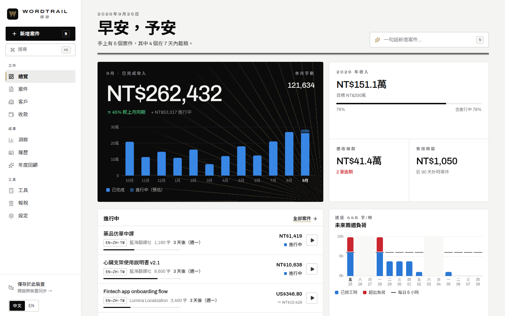
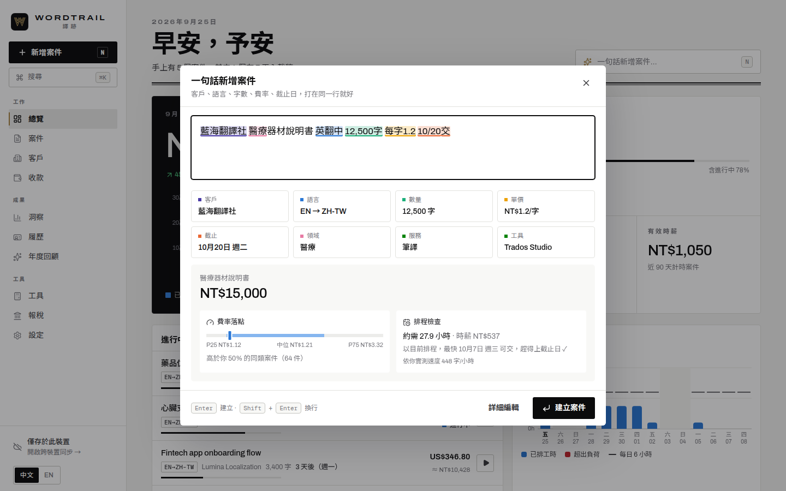
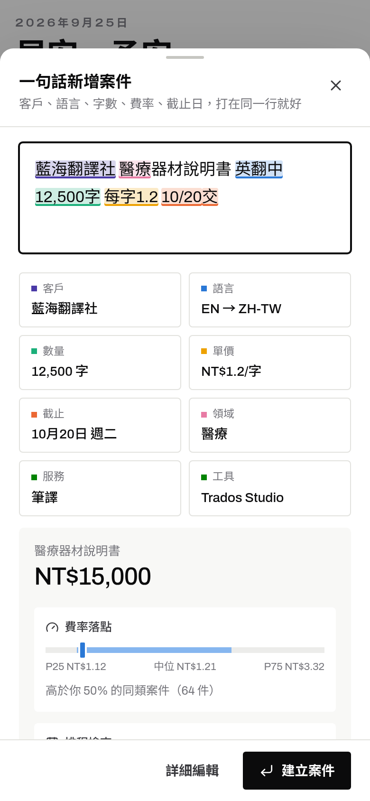
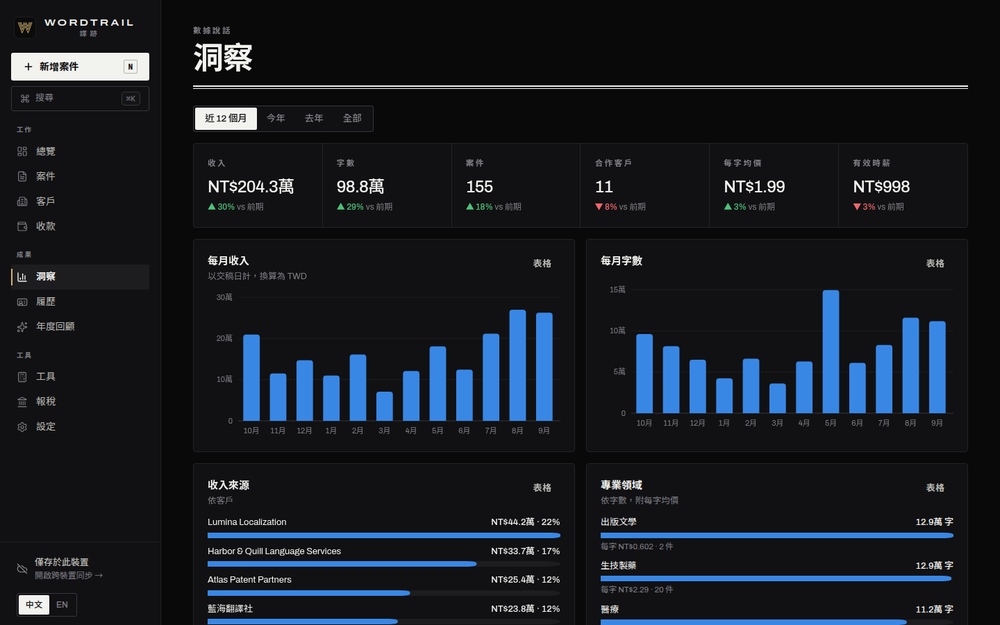
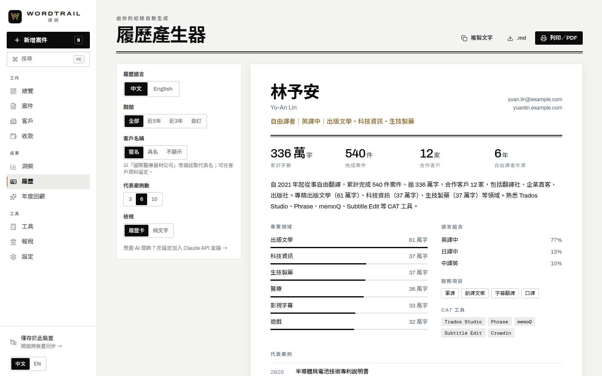
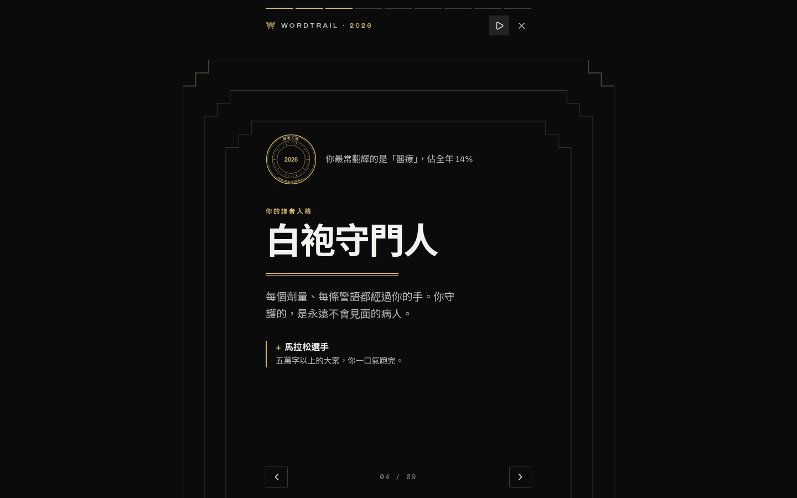

# 譯跡 Wordtrail

**每一個字，都算數。**

給自由譯者的工作紀錄 App：接案、交稿、請款、入帳，一路順手記下來；累積的每一筆紀錄，都會變成收入分析、報稅數字、中英文履歷和年度回顧。手機、平板、電腦都能用，離線也能用，資料以端對端加密在裝置之間同步。



| 一句話新增案件 | 手機版 | 深色模式 |
| --- | --- | --- |
|  |  |  |

**設計語言：瑞士網格 × Art Deco 未來主義。** 墨黑與紙白為底，只用一種黃銅金做裝飾；資料一律用驗證過的圖表色。標誌是一個以三條平行線畫成的「W」，是 Deco 的線條字，也是一條延伸出去的足跡。標題用可變寬度的 Archivo 與 Noto Sans TC，數字等寬對齊。

---

## 功能

### 中英雙語（English / 繁體中文）

- 整個介面都有**繁體中文**與**英文**兩種版本，隨時一鍵切換：桌機在側邊欄底部的「中文｜EN」，手機在「更多」選單，也可以在「設定 → 偏好」切換。
- 第一次開啟時會依瀏覽器語言自動選擇（中文瀏覽器 → 繁體中文，其他 → English）。
- 履歷、請款單的**輸出語言可以另外選**：介面用中文，照樣能產生英文履歷給國外客戶，反之亦然。

### 記錄：快到不需要思考

- **一句話新增案件**：輸入「藍海翻譯社 醫療器材說明書 英翻中 12,500字 每字1.2 10/20交」，客戶、語言組合、字數、單價、截止日、領域會即時標色並自動填好。支援中英文寫法：`EN>ZH-TW`、`3.2k words`、`@ $0.08/word`、`8 cents/word`、`1.2萬字`、`0.6元/字`、`下週三`、`明天下午3點`、`月底`、`due fri`……完全在本機解析，不需要網路。
- **記得你的習慣**：選了客戶，就自動帶入這位客戶常用的語言組合、領域、單位、費率與 CAT 工具。
- **接案當下就知道值不值得**：輸入時同步顯示「費率落點」（這個價格高於你過去多少比例的同類案件），以及「排程檢查」（依你的實測速度與手上工作量，最快哪天能交、趕不趕得上）。
- **CAT 分析報告加權**：直接貼上 Trados／memoQ／Phrase 的分析表，自動讀出 101%、重複、100%、95–99%…各區間字數，套用客戶專屬的折扣表計價。
- **各種計價方式**：單字、中文字元、小時（口譯）、影音分鐘（字幕）、頁、整案；急件加價、折扣、最低收費、手動總額。
- **多幣別**：每個案件鎖定建立當下的匯率，之後匯率怎麼變都不會改寫過去的收入；可一鍵更新最新匯率。
- **內建計時器**：一鍵開始計時，自動算出每個案件、每位客戶、每個領域的真實時薪與翻譯速度。
- **看板與列表**：拖曳卡片改變狀態（詢價 → 進行中 → 已交稿 → 已請款 → 已收款），收款時會「蓋章」。
- **⌘K 指令面板**與鍵盤快捷鍵（`N` 新增、`/` 搜尋、`G` → `J` 前往案件…）。

### 收錢：不再漏掉任何一筆

- **應收帳款與帳齡分析**：未到期、逾期 1–30／31–60／60 天以上，一眼看出該催哪一筆。
- **請款單**：勾選已交稿的案件，一鍵產生中文或英文請款單，可列印或存成 PDF。
- **台灣扣繳自動試算**：單次給付超過 2 萬元扣繳 10%、達 2 萬元代扣 2.11% 二代健保補充保費，自動算出實收金額（門檻與費率可調）。
- **報稅助手**：依收款年度整理 9B 稿費、9A 執行業務等類別，扣繳稅額、補充保費、稿費 18 萬免稅額與 30% 必要費用估算；按給付單位列出明細，方便和扣繳憑單對帳；提醒未經扣繳（例如國外客戶）需要自行申報的收入。

### 看懂自己：數字會說話

- **總覽**：本月收入與上月同期比較、12 個月趨勢、年度目標進度、應收帳款、有效時薪、進行中案件與截稿倒數、未來兩週工作負荷（超出每日工時會標紅）。
- **洞察**：收入來源集中度、各領域字數與每字均價、每字均價走勢、各客戶有效時薪、各領域翻譯速度、一週節奏、全年「翻譯足跡」熱力圖。
- **自動洞察卡片**：字價上升或下降、收入過度集中在單一客戶、哪位客戶付款偏慢、哪天會超載、哪位客戶時薪最高、年度目標預估達成率。
- **客戶評級 A–D**：綜合付款準時度、費率水準、合作份量與近期往來。
- **里程碑紀念章**：十萬字、百萬字、百件案件、第十位客戶……每個里程碑都會鑄成一枚 Art Deco 風格的金色紀念章。

### 留下成果：更新履歷只要一分鐘



- **履歷產生器**：從紀錄自動整理出中文或英文的履歷段落與一頁式「譯者檔案」：累計字數、案件數、客戶數、年資、專業領域分布、語言組合、CAT 工具、代表案例與合作客戶。
- **保密也沒問題**：客戶可選擇具名、匿名（例如「國際醫療器材公司」）或不顯示；保密案件只顯示領域與規模，也可以自訂對外名稱。
- 一鍵複製文字、下載 Markdown、列印成 PDF；也可以請 Claude 潤飾成更流暢的履歷文字（選用）。

### 年度回顧：分享你的一年



像 Spotify Wrapped 一樣的全螢幕故事：今年翻了多少字（相當於幾本長篇小說、印成 A4 疊多高）、最忙的月份、最重要的合作夥伴、收入成長、有效時薪、全年足跡，最後揭曉你的「譯者人格」（白袍守門人、條文煉金師、文字擺渡人……），並產生一張可以分享到社群的圖卡。

### 工具箱

- **字數統計與估價**：拖曳 .docx、.pptx、.xlsx、.odt、.srt、.vtt、.xliff、.po、.html、.txt 等檔案，或貼上文字；分別計算中日韓字元、全形標點、英文單字、Word 字數，直接換算報價與工時，再一鍵建立案件。
- **接案評估**：輸入客戶開價與截止日，顯示收入、預估工時、換算時薪、與過去同類案件的費率比較、建議報價（含急件加成），以及把這個案子排進去之後未來三週的負荷圖。
- **CAT 加權計算**與**匯率換算**。

---

## 開始使用

1. 打開網址：**https://b29925564.github.io/translator-log/**（需先依下方「部署」啟用 GitHub Pages）。
2. 第一次開啟時選擇介面語言、填上名字與記帳幣別；想先逛逛可以載入示範資料，之後在「設定 → 備份與匯入」一鍵清除。
3. 安裝成 App（離線也能用）：
   - **iPhone／iPad**：用 Safari 開啟 → 分享按鈕 → 加入主畫面
   - **Android**：用 Chrome 開啟 → 選單 → 安裝應用程式
   - **Mac／Windows**：Chrome 或 Edge 網址列右側的「安裝」圖示

### 從舊的 Excel 紀錄搬家

把試算表存成 CSV，在「設定 → 備份與匯入 → 從 Excel／CSV 匯入」上傳。欄位（日期、客戶、案件名稱、語言組合、字數、單價、金額、幣別、狀態、收款日、領域、備註……）會依中英文欄名自動對應，也可以手動調整；支援民國年、Excel 日期序號、`英翻中`／`EN>ZH` 等寫法。

---

## 手機與電腦同步

譯跡預設把資料存在瀏覽器本機（IndexedDB），不需要帳號、不經過任何伺服器。想讓手機與電腦共用資料時：

1. 在「設定 → 同步」點「開啟 GitHub 建立權杖」，只勾選 **gist** 權限（到期日可選 No expiration）。
2. 貼上權杖，設定一組**同步密語**，按「開啟同步」。
3. 在第二台裝置上，從第一台的「設定 → 同步 → 配對新裝置」掃描 QR Code，輸入同一組密語即可。

運作方式：

- 資料在裝置上先以 **PBKDF2-SHA256（60 萬次）→ AES-256-GCM** 加密並壓縮，只有密文會存進你自己 GitHub 帳號的**私人 Gist**。沒有密語，任何人（包括 GitHub）都無法讀取。
- 衍生出的金鑰以不可匯出的 `CryptoKey` 形式保存在裝置上，之後自動同步不需要再輸入密語。
- 每筆紀錄都有時間戳記與刪除標記，裝置之間以「較新者為準」合併，離線時的修改會在連線後自動補上。
- 配對 QR Code 內的權杖同樣以密語加密，單獨取得連結也無法使用。
- 忘記密語就無法解開雲端資料（本機資料不受影響），請妥善保存。

隨時可以在「設定 → 備份與匯入」匯出完整 JSON 備份或 CSV。

## AI 助理（選用）

在「設定 → AI 助理」加入你自己的 Claude API 金鑰後：

- 在「一句話新增案件」貼上整封客戶來信或 PO，按「用 AI 讀整封信件」自動擷取客戶、語言、字數、費率、截止日等欄位。
- 在履歷產生器請 Claude 把紀錄潤飾成自然的履歷段落（只根據真實紀錄，不誇大、不捏造）。

金鑰只存在該裝置，不會同步也不會匯出；費用由你的 Anthropic 帳戶直接計費。不設定金鑰時，所有功能照常使用本機解析。

## 隱私

- 沒有後端、沒有帳號、沒有追蹤、沒有廣告。
- 資料只存在你的裝置；開啟同步時只上傳加密後的密文到你自己的 GitHub。
- 對外連線只有：Google Fonts（字型）、匯率 API（按下更新時）、GitHub API（開啟同步時）、Anthropic API（設定 AI 金鑰時）。

---

## 部署（GitHub Pages）

儲存庫已附 `.github/workflows/deploy.yml`，推送到 `main` 時會自動測試、建置並部署：

1. 將這個分支合併到 `main`。
2. 到 GitHub 儲存庫 **Settings → Pages → Build and deployment → Source** 選 **GitHub Actions**。
3. 等 Actions 跑完，網址就是 `https://<你的帳號>.github.io/translator-log/`。

也可以部署到任何靜態主機（Netlify、Vercel、Cloudflare Pages）：`npm run build`，上傳 `dist/`。部署在子路徑時以 `BASE_PATH=/子路徑/ npm run build` 建置。

## 開發

```bash
npm install
npm run dev          # http://localhost:5173
npm test             # 單元與整合測試（解析器、稅務、合併、加密同步…）
npm run typecheck
npm run build        # 正式版 PWA → dist/
npm run build:demo   # 單一 HTML 檔的示範版 → dist-demo/
```

### 技術架構

| 層 | 選擇 |
| --- | --- |
| 介面 | React 19、TypeScript、Tailwind CSS 4、lucide 圖示、自製 SVG 圖表 |
| 資料 | Dexie（IndexedDB），離線優先；所有寫入集中在 `src/db/repo.ts` |
| 同步 | `src/sync/`：WebCrypto 端對端加密、GitHub Gist 儲存、最後寫入者優先合併 |
| PWA | vite-plugin-pwa（Workbox），可安裝、可離線 |
| AI | `@anthropic-ai/sdk`，使用者自備金鑰，結構化輸出擷取案件欄位 |
| 字型 | Archivo（可變寬度，標題與寬字距標籤）、Noto Sans TC、Geist Mono |

```
src/
  domain/    純函式：型別、一句話解析、字數統計、CAT 加權、統計引擎、稅務、履歷、合併、CSV、行事曆、示範資料
  db/        Dexie 資料庫、資料存取、React 資料 context
  sync/      加密、Gist 用戶端、同步引擎與設定畫面
  ai/        Claude 功能
  charts/    SVG 圖表（柱狀、橫條、折線、熱力圖、負荷圖）
  features/  一句話新增、案件／客戶編輯器、請款單、CSV 匯入等
  pages/     各頁面
  ui/        設計元件、格式化、全域狀態
tests/       Vitest
```

---

## English summary

Wordtrail is a local-first, installable web app for freelance translators. Log a job in one sentence ("Lumina app strings EN>ZH-TW 3.2k words @ $0.09/word due Fri"), track time, CAT-weighted pricing, multi-currency income and receivables, generate invoices, see where your money comes from, check whether a new offer is a good rate and whether it fits your schedule, build a bilingual CV section from your real record, and share a Spotify-Wrapped-style year in review. Data stays on your device; optional sync is end-to-end encrypted into a private Gist on your own GitHub account. The whole interface is available in English and Traditional Chinese (switch any time from the sidebar, the More menu or Settings; the first visit follows your browser language), and résumés and invoices can be produced in either language independently of the interface.
